# AI Use

## AI Tools Used

| AI Integrated IDE | LLMs Used                           | Tasks performed                                                                                                                                    |
|-------------------|-------------------------------------|----------------------------------------------------------------------------------------------------------------------------------------------------|
| Antigravity       | Claude Opus 4.6                     | Used for initial brain storming, writing-plans to generate a spec                                                                                  |
| Intellij Goland   | Claude Sonnet 4.6, Claude Haiku 4.5 | Used it for resolving very small errors such as type mismatch                                                                                      |
| Chat GPT online   | GPT-5.5 Instant                     | Used it for resolving a docker error. Since I was using postgres-latest image, the volume path had to be modified (according to the latest update) |
| Claude online     | Sonnet 5                            | Used it for generating a script for k6 test (smoke, stress, load, soak)                                                                            |

## Prompts Used

I have used obra superpowers open source skills plugin for using AI efficiently for the project. Some of the prompts that I have used:

1. "`Use brainstorming and creating-plan skills in the folder to help me implement the assignment in the screenshots`"
2. "`Just explain in 1 or 2 paragraphs Approach B`"
3. "`Yes, proceed with Approach A — write the spec and plan`"

Most of the responses from the LLMs were just approaches and plans which I needed to review and provide feedback if necessary

### Screenshots:
1.  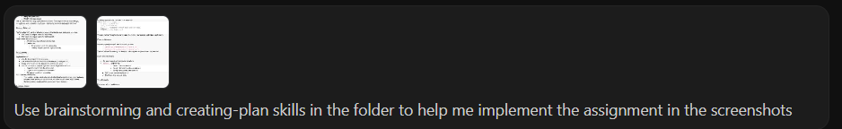
2.  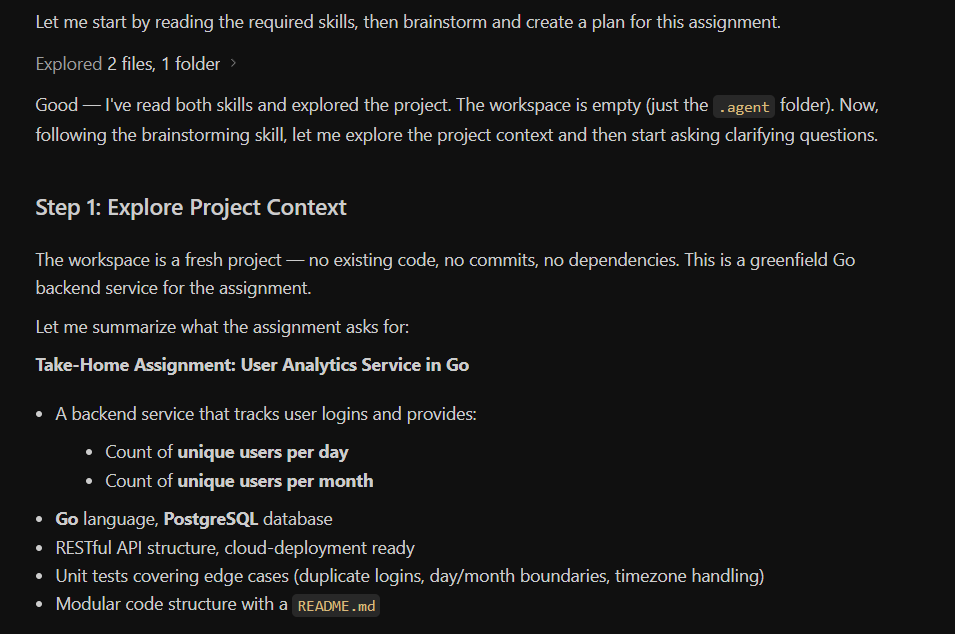
3.  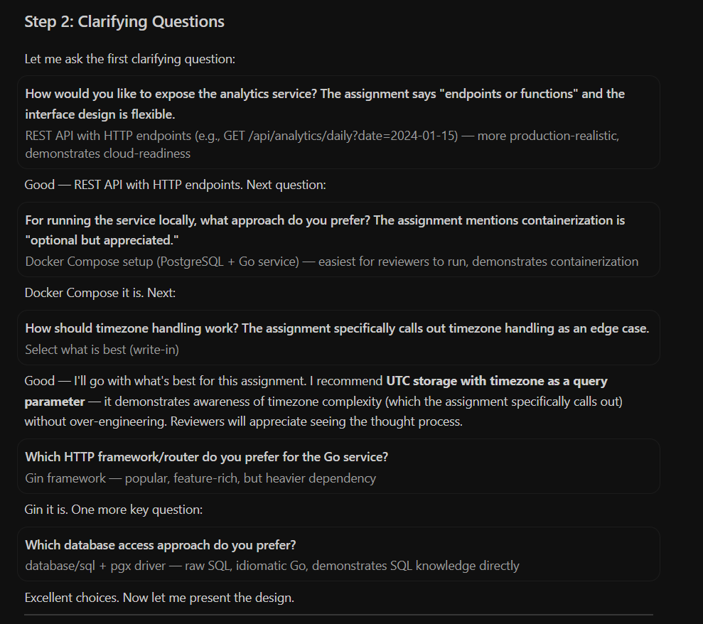
4.  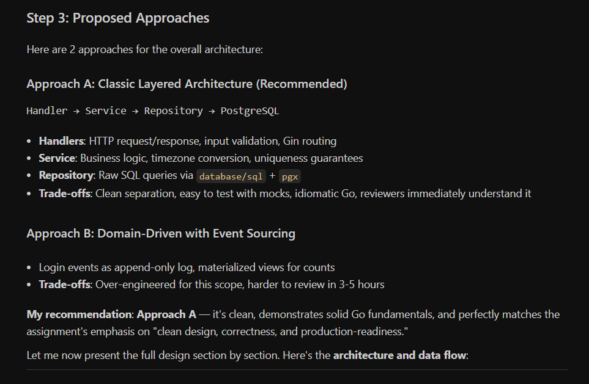
5.  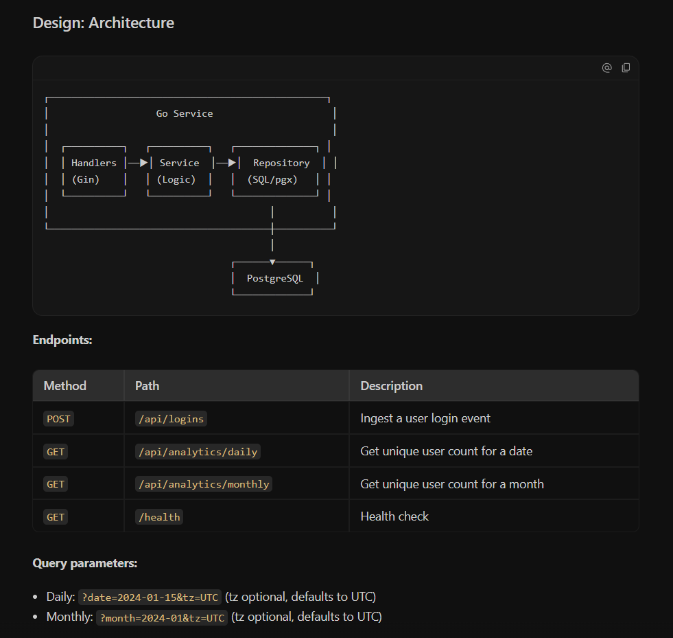
6.  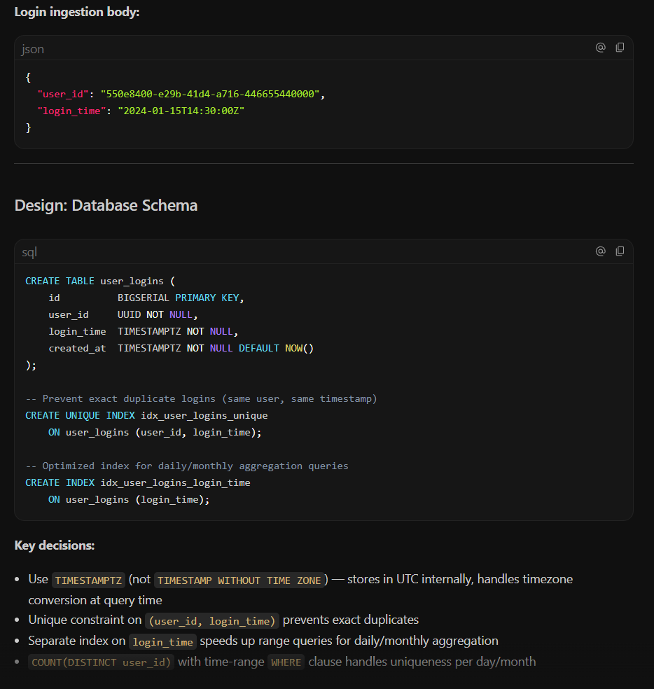
7.  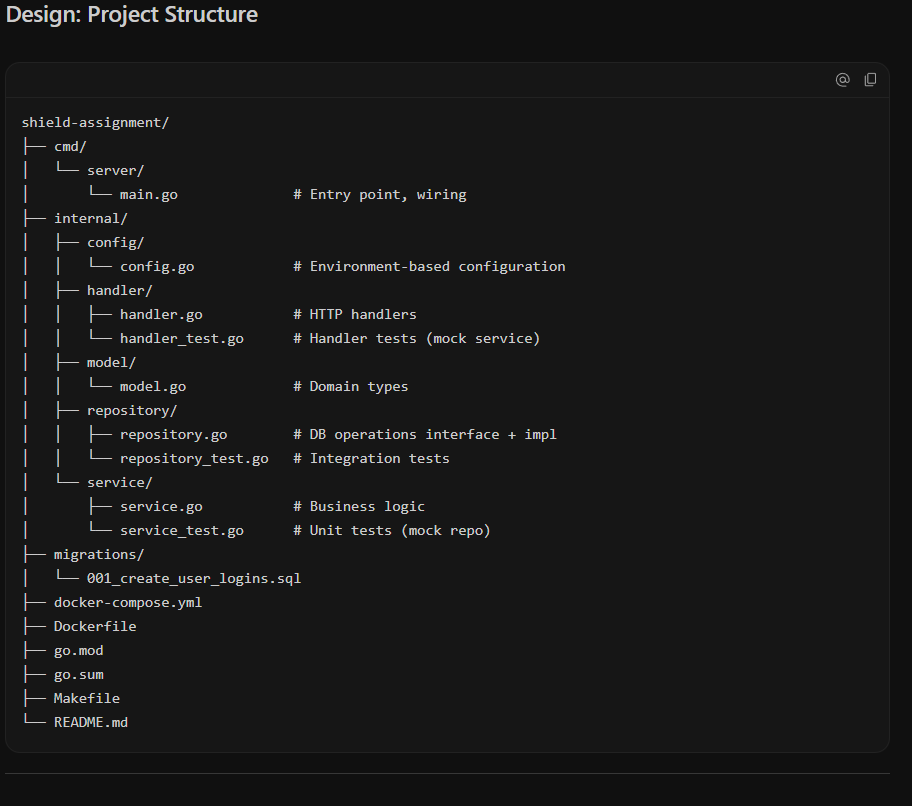
8.  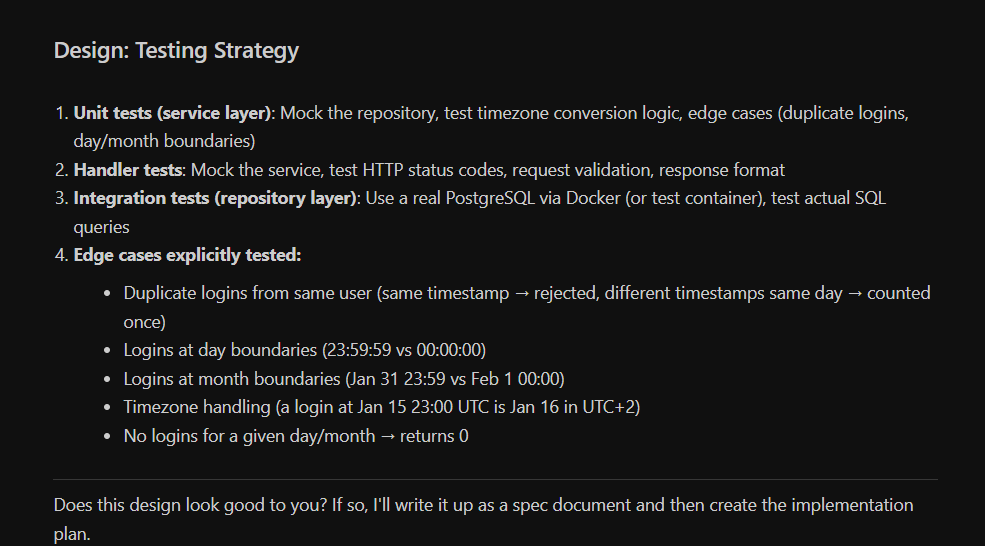
9.  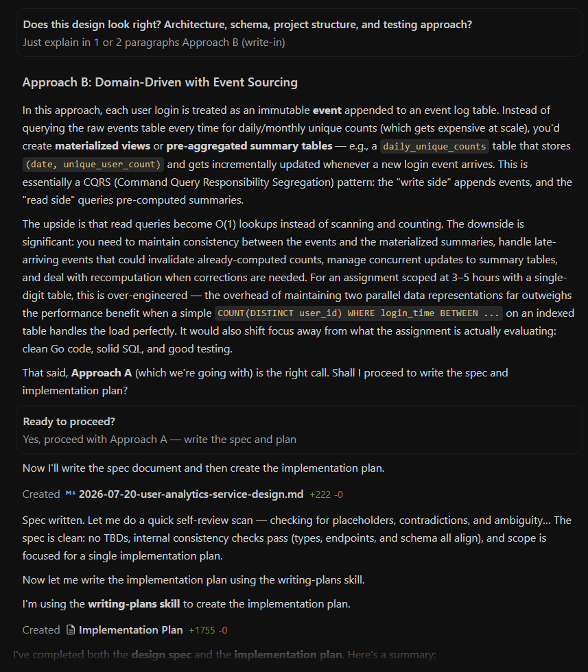
10. 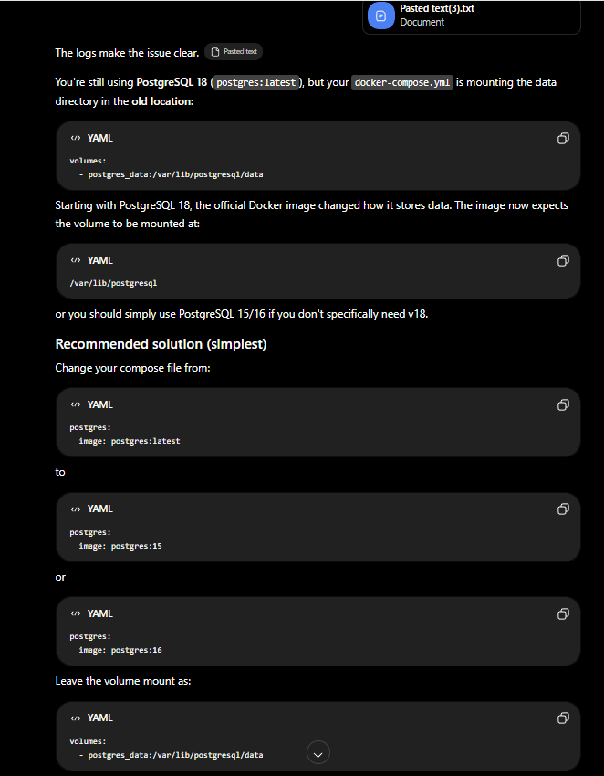
11. 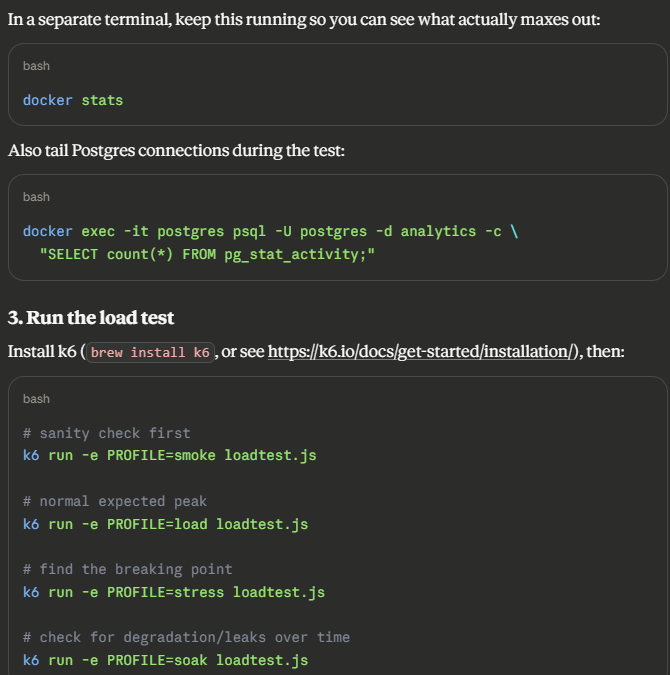

## Feedback and corrections

Since I used superpowers skill plugin, hallucinations were greatly reduced. But I still had to review the responses and provide feedback if necessary. For instance:
- In the `users_login` table `id` column type was chosen as `BIGSERIAL`. But I wanted type to be `UUID` according to industry standards. 
- Similarly, in the `LoginEvent` model `id` type was chosen as `string` (considering LLM had chosen `BIGSERIAL` for `id`). So I had to change it to `uuid.UUID`.
- The generated plan also had a Health Check endpoint, but I found it unnecessary in the project's scope, so I dropped it.
- My free quota for the model was exhausted just after writing the implementation plan. So all these corrections I did manually.
- Since the quota was exhausted, I was not able to use executing-plan and subagent-driven-development skills. Otherwise, I would have made the submission earlier.
- Also, I would like to mention that the implementation plan used a `gin.Default()` and normal `sql.Open()` without setting any `SetMaxOpenConns`, `SetMaxIdleConns`, `SetConnMaxLifetime`. So I generated a script using Claude Sonnet 5 for testing the app on scale. After the test, claude suggested that I should change `gin.Default()` to `gin.SetMode`, `(gin.ReleaseMode)`, `gin.New()`, `router.Use(gin.Recovery())` in `main.go` so that compute power is not wasted in logs and panic recovery. It also suggested to add `SetMaxOpenConns`, `SetMaxIdleConns`, `SetConnMaxLifetime` in `repository.go` so that db does not keep opening new connections.

